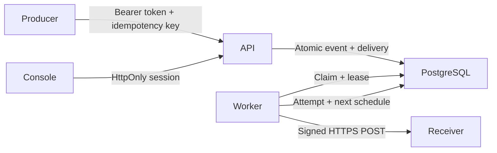

# Architecture

## Implemented system

Hooklane v1 is a single Go application with a React management console and
PostgreSQL as its source of truth and work queue. The initial product serves one
trusted team per installation. Organizations, billing, multi-tenant isolation and
managed SaaS infrastructure are outside this version.

| Package | Responsibility |
| --- | --- |
| `cmd/api` | Pool, migration readiness, worker and HTTP lifecycle |
| `internal/config` | Validated process configuration without leaking values |
| `internal/httpserver` | Authentication, input validation, metadata API, metrics, health and static files |
| `internal/store` | Transactions, encrypted signing secrets, queue invariants, embedded Goose migrations |
| `internal/store/sqlc` | Generated pgx read queries from checked-in SQL |
| `internal/delivery` | Outbound network policy, signing, response classification, retry timing and retention loop |
| `web` | Strictly validated API client and management console |

The standard library provides HTTP, structured logging, cryptography and process
lifecycle. SQL remains explicit; sqlc handles typed read queries while queue and
transactional mutations use pgx directly. No generic repository framework or
separate broker is involved. Interfaces live at HTTP and worker consumption
boundaries for testing. A fixed worker pool avoids spawning unbounded deliveries.

Go serves compiled assets in Docker; Vite proxies API calls during development.
The React UI uses Tailwind CSS 4, shadcn configuration and copied beUI registry
components for navigation, buttons, fields, selectors, switches, tables, badges,
dialogs and notifications. The textarea uses shadcn/ui. Registry source remains
local so accessibility and strict typing fixes can be reviewed; see
[`web/THIRD_PARTY_NOTICES.md`](../web/THIRD_PARTY_NOTICES.md) for attribution.
Paginated tables render all rows without virtualization; larger callers can opt
into the registry virtualizer. Operational pages load on demand.
Presence animations use `sync` instead of dynamic stylesheet injection, preserving
the API's strict `style-src 'self'` policy.

The UI uses hash navigation and local hooks, so deep links do not require an HTML
fallback for unknown API paths. Browser tokens are exchanged for signed HttpOnly,
SameSite=Strict cookies, not stored in browser storage. Only metadata is returned:
event bodies, signing secrets, and receiver bodies never appear in read responses.

## Startup and health

- `GET /healthz` reports HTTP liveness without probing PostgreSQL.
- `GET /readyz` requires successful migration and encryption-key validation, then
  a database ping within `READINESS_TIMEOUT`.
- Management data routes and ingestion stay unavailable until initialization
  completes; session routes and the console remain available.
- Embedded Goose migrations use a PostgreSQL advisory lock across replicas.
- Database initialization retries without restarting the process.
- SIGINT/SIGTERM cancels workers, drains HTTP, records interrupted attempts when
  possible, and closes the pool after worker completion. Unrecorded claims expire.

Health responses are not cached and never reveal driver errors. API operations
have an eight-second context; HTTP reads and writes are bounded. Receiver requests
have a separate configured deadline. Signing secrets use AES-256-GCM with random
nonces and the destination ID as authenticated associated data. Changing the
installation encryption key without re-encryption prevents readiness.

## Future delivery invariants

The original design invariants below are now implemented; this anchor remains
stable for existing links.

1. **Atomic acceptance.** A successful ingestion response follows the commit of
   an event and its initial delivery in one transaction. A per-destination unique
   idempotency key returns the existing result for the same event type and exact
   payload bytes, or a conflict for different content.
2. **At-least-once delivery.** The receiver may accept a request just before a
   process/database failure prevents recording success. A retry can duplicate it.
   `Webhook-Id` is stable across attempts and replays; receivers deduplicate it.
3. **Short claims.** Workers use `FOR UPDATE SKIP LOCKED`, persist an attempt and
   random claim token, commit, and only then call the receiver. Network I/O never
   runs inside a database transaction.
4. **Recovery and fencing.** Claims expire after the request deadline plus fifteen
   seconds. Recovery marks the old attempt abandoned and makes another attempt
   eligible, or exhausts its budget. A result only applies while its token and lease
   are current. Destination locks coordinate claims and archive operations.
5. **Persisted retries.** Temporary failures persist their next scheduled time.
   Request timeouts, concurrency, attempts, exponential jitter and `Retry-After`
   are bounded. There is no ordering guarantee, per-destination fairness guarantee,
   or indefinite retry promise.
6. **Replay lineage.** A terminal delivery can produce new delivery work with a new
   retry budget and a link to its source. The original event and attempts remain.
   Replay uses its own idempotency key and the current destination configuration.

## Destination lifecycle and retention

A paused destination keeps accepting events but its work is not claimed. Resume
allows queued work to proceed. A request already claimed may finish after pause
or after a URL/secret change. Rotation applies to future claims; coordinate a
receiver overlap window to tolerate the old secret while requests drain.

Archive is irreversible in v1. It blocks new ingestion and replay, cancels queued
work, and lets in-flight work finish without scheduling further retries. A new
destination can be created if needed. Cancel only applies to pending/retrying
work; active requests cannot be recalled.

Payload redaction requires every delivery of that event to be terminal. It keeps
metadata and the payload hash/size but disables new replay. Automatic retention
deletes expired terminal events and their delivery/attempt history in batches of
up to 500 per process, on startup and after each one-minute cleanup interval. Event locks and a fresh eligibility check serialize cleanup
with replay/redaction. Active and paused queued work are retained even past the
age limit; monitor their disk usage. Idempotency protection ends when the event
is deleted. Metadata and backups can still be sensitive.

## Outbound policy

HTTPS with a publicly routable destination is the default. URL credentials, query
strings and fragments are rejected. Hostnames are checked on destination creation
and URL changes, then resolved/validated again when dialing each new socket; the socket connects
directly to the checked IP while preserving the original TLS hostname. Redirects
and environment proxies are disabled. Private ranges require explicit configured
CIDRs; HTTP requires a separate explicit opt-in. Metadata, link-local, multicast,
reserved and known translation ranges are blocked. The deployment guide describes
network-level restrictions as a second boundary.

## Verification scope

Unit tests exercise auth/CSRF, validation, network policy, signing, retry and
cancellation behavior. PostgreSQL integration tests cover atomic rollback,
concurrent deduplication and claiming, stale-result fencing, lease recovery,
exhaustion, replay, redaction, archive/finish races and replay/retention races.
Docker smoke checks exercise the real HTTP/database/receiver path. These checks
validate behavior, not a general throughput or availability SLA.

## References

- [Go HTTP transport](https://pkg.go.dev/net/http#Transport)
- [PostgreSQL locking and SKIP LOCKED](https://www.postgresql.org/docs/18/sql-select.html)
- [Goose providers](https://pressly.github.io/goose/blog/2023/goose-provider/)
- [sqlc generation](https://docs.sqlc.dev/en/latest/howto/generate.html)
